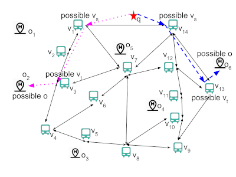

# Constrain Sekyline Query
This repository is the source code for our paper "Gong, Q., H. Cao and P. Nagarkar. “Skyline Queries Constrained by Multi-cost Transportation Networks.” 2019 IEEE 35th International Conference on Data Engineering (ICDE) (2019): 926-937."  
The JAVA implementation of the [Skyline Queries Constrained by Multi-cost Transportation Networks
](https://ieeexplore.ieee.org/abstract/document/8731518). Given a multi-cost transportation network (MCTN), a list of POI objects **D** (could be on/off the MCTN) and a query POI object **q** in **D**, constrain skyline queries return the skyline solutions from **q** to objects **o** in **D**, where one solution is consists of the costs of the walking distance, the cost of the road network paths and the cost of the reached object **o**. 
<p align="center">
  
</p>
The code implements four methods that are used to solve the constrain skyline query with/without the index. The goodness score could be calculated as well. Moreover, related pre-processes are implemented as well, include creating synthetic road network, generating synthetic POI objects data, and building the index.  


## Preliminary 
- Neo4j,[https://neo4j.com/](https://neo4j.com/), our code embedded Neo4j ([https://neo4j.com/docs/java-reference/current/java-embedded/](https://neo4j.com/docs/java-reference/current/java-embedded/)). So there is no need to install the neo4j physically. 
- [Apache Maven](https://maven.apache.org/)
- [Apache commons-io](http://commons.apache.org/proper/commons-io/)
- [Apache commons-math3](https://commons.apache.org/proper/commons-math/)
- [Apache commons-cli](https://commons.apache.org/proper/commons-cli/)
- JAVA 8, if you are not using JAVA8, please make sure the [JavaFX](https://en.wikipedia.org/wiki/JavaFX) is included in your JAVA path. 

## Data
### Synthetic data
Synthetic road networks and POI (points of interest) objects can be generated with given ```# of graph nodes, average degree, # of edges, # of POI objects and the dimension of POI costs and edge costs```. The details can be found in the *usage* section. 

### Real word data
Real datadsets are obtained from three cities, New York(NY), Los Angeles (LA), and San Francisco (SF), using rideschedules (https://rideschedules.com) and Google Maps API. The node and edge information of each city is stored under the folder ```Data/RoadNetworks```.
Each graph node represents a bus stop. Note that close bus stops whose the distance is within fifty meters are treated as one node. 
Each graph edge represents a segment in a bus line with **three**-dimensional costs. The raw data only contains one cost value that is the *distance* between two end nodes of a edge. Other two cost values are generated by sampling from a uniform distribution based on the distance. 
For the objects of interest, we extract three non-spatial attributes (rating, price, and interestingness) from the information crawled using Google Maps. For the simplicity, the lower value of the rating and the interestingness is better. The interestingness is the number of tags of a POI object tagged by Google.  
- Nodes are organized as ```[node_id, latitude, longitude]``` in the ```NodeInfo.txt``` started with the city name.  
- Segments are organized as ```[node_id, node_id, distance, cost2, cost3]``` in the ```SegInfo.txt``` started with the city name.
- POI objects are organized as ```[Obj_id, latitude, longitude, rating, price, interestingness, google_place_id, obj_name]``` in ```the staticNode_real_*.txt``` with the city name and the type of POI. The ```google_place_id``` is the place id returned by Google Map APIs.  

## Compile
Execute the maven command, ```mvn clean compile assembly:single```, to compile and package the code. The executable jar file is placed under the *'target'* folder. 

## Usage
```
usage: java -jar constrainSkylineQuery.jar
Run the code of the constrain skyline path query :
 -c,--city <arg>                 the city name (NY, LA and SF) of the
                                 real-world dataset.
 -d,--distance_threshold <arg>   distance threshold that is used in the
                                 approximation methods, the default value
                                 is '30'.
 -e,--measure <arg>              the measure is used to calculate the
                                 distance between two points, the default
                                 value is 'euclidean'.
 -gd,--grahpdegree <arg>         degree of the graph, the default value is
                                 '4'.
 -gm,--grahpdimension <arg>      dimension of the graph, the default value
                                 is '3'.
 -gs,--grahpsize <arg>           number of nodes in the graph, the default
                                 value is '1000'.
 -h,--help                       print the help of this command
 -hd,--poidimension <arg>        dimension of the poi objects, the default
                                 value is '3'.
 -hn,--poinumber <arg>           number of the poi objects, the default
                                 value is '200'.
 -i,--index <arg>                index enable/disable, the default value
                                 is 'false'.
 -id,--index_threshold <arg>     the distance range that is used to build
                                 the index, the default value is '-1'.
 -m,--method <arg>               method to execute, the default value is
                                 'exact_improved'.
 -p,--path <arg>                 detailed path information that stores the
                                 nodes and edges.
 -q,--query <arg>                query by a given object ID or a random
                                 generated POI object ID), the default
                                 value is '-1'.
 -r,--range <arg>                the range parameter to generate the
                                 synthetic data, the default value is
                                 '20'.
 -u,--poinumber <arg>            the maximum number of POI objects that
                                 are within given range, the default value
                                 is '60'.
 -v,--verbose <arg>              calculate the goodness score while
                                 executing the approximate methods, the
                                 default value is 'false'.
```

## Details and examples
1. Generate synthetic road network data. Given the number of graph nodes, degree and the dimension of the cost on each edge.  
>```java -jar constrainSkylineQuery.jar -m GenerateSynethicRoadNetwork -gs 1000 -gd 4 -gm 3```  
2. Create the Neo4j DataBase based on a given graph information.  
>```java -jar constrainSkylineQuery.jar -m CreateRoadNetworkDB -gs 1000 -gd 4 -gm 3```  
3. Generate synthetic POI objects based a given graph information, number of objects and the number of dimension of POI objects.  
>```java -jar constrainSkylineQuery.jar -m GenerateSynethicPOIsData -gs 1000 -gd 4 -gm 3 -hn 200 -hd 3 -r 20 -u 60```  
```r``` is the range that is used to count # of bus stops are within ```r``` of a generated object.  
```u``` is the threshold of the max number of bus stops are within ```r``` of a generated object  
4. Build the index for a given graph and a list of POI objects. The ```id``` is the range (distance threshold) that is used to calculate the index from graph nodes to POI objects. The default value of ```id``` is **-1** which means no index distance threshold. The detailed calculation can be found in the paper. 
> * ```java -jar constrainSkylineQuery.jar -m IndexBuilding -gs 1000 -gd 4 -gm 3 -hn 200 -hd 3 -r 20 -u 60 -id 500 -e actual```  
> * ```java -jar constrainSkylineQuery.jar -m IndexBuilding -gs 1000 -gd 4 -gm 3 -hn 200 -hd 3 -r 20 -u 60```
> * ```java -jar constrainSkylineQuery.jar -m IndexBuilding -gs 1000 -gd 4 -gm 3 -hn 200 -hd 3 -r 20 -u 60 -id -1```  
5. Execute the exact methods (*ExactBaseline* and *ExactImproved*) with given graph information and a query POI object. If the query object Id is not given, a random generated object will be used to conduct the query with parameter ```-r```. 
> * ```java -jar constrainSkylineQuery.jar -m ExactBaseline -gs 1000 -gd 4 -gm 3 -hn 200 -hd 3 -r 20```  
> * ```java -jar constrainSkylineQuery.jar -m ExactImproved -gs 1000 -gd 4 -gm 3 -hn 200 -hd 3 -r 20 -i true -v true```
6. Execute the approximate methods (*ApproxRange* and *ApproxMixed*) with given graph information and a query POI object. If the query object Id is not given, a random generated object will be used to conduct the query. Compared with the exact methods, one extra parameter, distance_threshold, ```d```, is used to constrains the range of searching from a graph node to POI objects. **NOTICE:Before executing the approximate methods with a given distance threshold by using index, a corresponding index with same index_threshold, ```id```, as distance_threshold needs to be created before.**
> * ```java -jar constrainSkylineQuery.jar -m ApproxMixed -gs 1000 -gd 4 -gm 3 -hn 200 -hd 3 -r 20 -d 30```  
> * ```java -jar constrainSkylineQuery.jar -m ApproxRange -gs 1000 -gd 4 -gm 3 -hn 200 -hd 3 -r 20 -d 40 -i true -v true```
> * ```java -jar constrainSkylineQuery.jar -m ApproxRange -gs 1000 -gd 4 -gm 3 -hn 200 -hd 3 -r 20 -d 500 -i true -v true -e actual```
***************
- Graph information is identified by the graph size, degree and dimension
- POI object information is identified by the given graph with the range, the number of POIs and the POI object cost dimension. 
- The **index version** of queries is enabled by using the ```-i true```, when ```-m``` is equals to ```ExactBaseline```, ```ExactImproved```, ```ExactBaseline``` and ```ApproxMixed```.
- The **Goodness score** of the approximate method is calculated and displayed by using ```-v true```
- The **measurement of the distance** could be calculated by the **‘haversine’ formula** (```-e actual```) and the **L-2** distance (```-e euclidean```). The calculation of actual meters is much time consuming than the **L-2** distance calculation.
- The graph nodes and edges information are stored in the ```NodeInfo.txt``` and ```SegInfo.txt``` under the corresponding graph folder in the ```Data``` folder.
- The neo4j database files are stored under the folder ```Data\Neo4jDB_files```.
- The index files are stored under the folder ```Data\index```.
- Default values and the paths can be changed in the ```tools.configuration.constant``` file.
- When ```-p``` is set to be ```false```, the visited ratio related value will not be counted. 

## output
The performance results are displayed like:  
>```181|195 14| running time(ms):3,51,471,0,1747| overall:3153   1217(789+125+1+0+269),355|result size:2584 109|984,547,0.5558943089430894|695389,13126,14110,8318```  
>```181|195 14| running time(ms):11,52,165,89,281| overall:1845   41(28+6+0+0+4),113|result size:382 95|984,346,0.3516260162601626|16965,3533,3545,4026```

Where are ```[query object ID], [# of POI objects don't dominated by the query object], [# of skyline POI objects in ], [Best First Search Time], [Nearest Graph Node search Time], [Search on the Graph Time], [Index Search Time], [Query time without Index], [Overall Query Time], [Time used to form the final result and add the result set] (Components: [Add to results time], [condition checking time], [Map operation time], [Empty checking time], [POI object Reading Time], [Path Expansion Time]), [# of Skyline Solutions], [# of distinct POI objects], [# of visited graph nodes], [# of graph nodes in the final solutions], [visited ratio], [# of times form the candidate solutions], [# of prefix skyline paths from query object to each graph nodes], [# of pop-up times from the queue],``` from left to right. 
***************
- When ```-p``` is set to be ```false```, the visited ratio related value will not be counted. 


## Three Examples to Run the Code:
##### Example 1: Conduct the query by using the approxMixed method on a new synthetic road network and a list of synthetic POI objects. 
1. Generate a synthetic graph with **2000** nodes that the average degree is **4** and the dimension of each edge in the graph is **3**. The generated node and edge information are stored under ```Data\2000_4_3\``` folder. 
2. Create the Neo4j DB files by using the generated node and edge files, which are stored under ```Data/Neo4jDB_files/2000_4_3```. 
3. Generate **200** POI objects with **3-dimensional** costs based on the generated 2000 nodes synthetic graph. Moreover, we set the range to be **15** and the maximum number of objects that are within range are **60** in order to follow the number of POI objects within a given range. **The distance is the euclidean distance, which can be changed by the parameter ```-e```. It may need a long running time when the parameters of the range ```-r``` and the upper ```-u``` is set improperly.** The tree and object information are put ```Data/2000_4_3/``` as well.
4. Generate the index file with the index distance 30. The index files are stored at ```Data/index/2000_4_3_15.0_200_30```.
5. Conduct the query with a random generated query object by using the ```approxMixed``` method with a distance_threshold **30**. Also, the goodness is calculated where the exact method is called automatically. The index with the given distance_threshold must be created before (we generated the index with the index distance **30** at step 4 already). Moreover, If the approximate methods are called and the ```-v``` is set to true, make sure the overall index is created before (```java -jar constrainSkylineQuery.jar -m IndexBuilding -gs 2000 -gd 4 -gm 3 -hn 200 -hd 3 -r 15 -id -1```) for conducting the exact query.
> 1. java -jar constrainSkylineQuery.jar -m GenerateSynethicRoadNetwork -gs 2000 -gd 4 -gm 3
> 2. java -jar constrainSkylineQuery.jar -m CreateRoadNetworkDB -gs 2000 -gd 4 -gm 3
> 3. java -jar constrainSkylineQuery.jar -m GenerateSynethicPOIsData -gs 2000 -gd 4 -gm 3 -hn 200 -hd 3 -r 15 -u 60
> 4. java -jar constrainSkylineQuery.jar -m IndexBuilding -gs 2000 -gd 4 -gm 3 -hn 200 -hd 3 -r 15 -id 30 
> 5. java -jar constrainSkylineQuery.jar -m ApproxMixed -gs 2000 -gd 4 -gm 3 -hn 200 -hd 3 -r 15 -d -1 -v true -i true -e actual  

##### Example 2: Conduct the query by using the approxRange method on the real-world data of SF using the actual distance in meters. 
1. Put the ```SF_NodeInfo.txt```, ```SF_SegInfo.txt```, and ```staticNode_real_SF``` of San Francisco to the folder ```Data\SF```
2. Create the Neo4j DB files for SF.
3. Store the POI objects of SF to the Rtree
4. Build the index with *1500* meters for all the network nodes. In order to make the distance calculation to be actual meters,  the parameter ```-e actual``` is added.
5. Conduct the query with a random query point. **Make sure the parameter ```-e actual``` is added. If approximate methods are called and the ```-v``` is set to true, make sure the overall index is created before (```java -jar constrainSkylineQuery.jar -m IndexBuilding -c SF -gm 3 -id -1 -e actual```)**
6. If ```-v``` parameter is set ```True```, the index file of SF with index distance ```-1``` need to be created. 
> java -jar constrainSkylineQuery.jar -m CreateRoadNetworkDB -c SF  
> java -jar constrainSkylineQuery.jar -m GenerateSynethicPOIsData -c SF -hd 3  
> java -jar constrainSkylineQuery.jar -m IndexBuilding -c SF -hd 3 -id 1500 -e actual  
> java -jar constrainSkylineQuery.jar -m ApproxRange -c SF -hd 3 -gm 3 -d 1500 -v true -i true -e actual  
> java -jar constrainSkylineQuery.jar -m IndexBuilding -c SF -hd 3 -id -1 -e actual  

##### Example 3: Conduct the query by using the approxRange method on the real-world data of SF using the euclidean distance instead of actual meters.  
1. Step 1 ~ 3 are same as the **Example 2**. 
2. Convert the actual distance to the euclidean distance and build the index with the converted index distance. 
3. Query by using the specified distance with index. 
> java -jar constrainSkylineQuery.jar -m CreateRoadNetworkDB -c SF  
> java -jar constrainSkylineQuery.jar -m GenerateSynethicPOIsData -c SF -gm 3  
> java -jar constrainSkylineQuery.jar -m IndexBuilding -c SF -hd 3  -id 0.0105  
> java -jar constrainSkylineQuery.jar -m ApproxRange -c SF -hd 3  -gm 3 -d 0.0105  -v true -i true  
> java -jar constrainSkylineQuery.jar -m IndexBuilding -c SF -hd 3 -id -1  

## Acknowledgements
This work was supported by NSF #1633330.  
Special thanks for the JAVA implementation of the [R*-tree](http://chorochronos.datastories.org/?q=node/43)\[1\].  
[1] Beckmann, N., H. Kriegel, R. Schneider and B. Seeger. “The R*-tree: an efficient and robust access method for points and rectangles.” SIGMOD '90 (1990).
